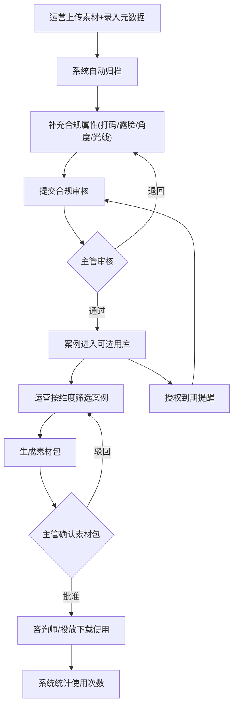

## 1. 产品概述

医美案例库工作台是为医美机构运营主管打造的统一素材管理平台，解决术前术后照片、视频、面诊记录等素材散落、归档混乱、合规审核缺失、投放选用低效等痛点。目标用户为机构运营主管、运营专员、咨询师及市场投放人员，核心价值在于实现素材从入库到投放的全生命周期闭环管理，提升案例复用效率、保障合规安全。

## 2. 核心功能

### 2.1 用户角色

| 角色 | 注册方式 | 核心权限 |
|------|----------|----------|
| 运营主管 | 管理员分配 | 全模块读写、审核审批、数据看板、素材包分发 |
| 运营专员 | 主管邀请 | 素材入库、案例归档、标签管理、打码处理 |
| 咨询师 | 主管邀请 | 浏览可公开案例、下载审批素材、查看顾客关联 |
| 投放人员 | 主管邀请 | 浏览可投放案例、申请素材包、查看使用统计 |

### 2.2 功能模块

1. **素材入库页**: 批量上传、元数据录入、自动归档、打码处理
2. **案例档案页**: 案例详情、前后对比拼图、恢复时间轴、医生点评、授权状态
3. **合规审核页**: 审核列表、授权状态标记、敏感部位打码确认、过期授权提醒
4. **投放选用页**: 多维筛选、素材包生成、适用渠道筛选、下载审批
5. **数据看板页**: 案例使用次数统计、项目分布、授权到期预警、渠道投放效果

### 2.3 页面详情

| 页面名称 | 模块名称 | 功能描述 |
|----------|----------|----------|
| 素材入库页 | 批量上传区 | 支持拖拽批量上传照片/视频，显示上传进度，自动识别文件类型 |
| 素材入库页 | 元数据表单 | 录入顾客编号、治疗项目、主刀医生、拍摄角度、光线标准、是否可露脸 |
| 素材入库页 | 项目标签选择 | 多选项目标签，支持自定义标签，标签与治疗项目联动 |
| 素材入库页 | 自动归档预览 | 按顾客编号+项目+医生+恢复周期自动分组预览 |
| 素材入库页 | 打码工具 | 框选敏感区域自动打码，支持马赛克/模糊两种模式 |
| 案例档案页 | 案例列表 | 卡片式展示案例缩略图，显示关键标签和授权状态 |
| 案例档案页 | 前后对比拼图 | 左右/上下滑动对比术前术后照片，支持多组对比 |
| 案例档案页 | 恢复时间轴 | 按恢复天数排列照片时间线，标注关键恢复节点 |
| 案例档案页 | 医生点评录入 | 弹窗录入医生对恢复效果的文字点评 |
| 案例档案页 | 面诊记录摘要 | 展示关联面诊记录的关键摘要信息 |
| 合规审核页 | 审核队列 | 按提交时间排列待审核素材，高亮过期授权 |
| 合规审核页 | 授权状态标记 | 切换已授权/待授权/已拒绝/已过期状态 |
| 合规审核页 | 打码确认 | 审核打码效果，确认或退回重新打码 |
| 合规审核页 | 过期授权提醒 | 即将过期(7天内)和已过期授权的醒目提醒列表 |
| 投放选用页 | 多维筛选器 | 按项目/年龄段/恢复天数/授权状态/适用渠道组合筛选 |
| 投放选用页 | 案例卡片预览 | 筛选结果以卡片展示，快速预览前后对比 |
| 投放选用页 | 素材包生成 | 选中案例后一键生成素材包，提交主管确认 |
| 投放选用页 | 下载审批流 | 投放人员申请下载，主管审批后提供下载链接 |
| 数据看板页 | 案例使用统计 | 各案例被引用/下载次数排行，使用趋势折线图 |
| 数据看板页 | 项目分布图 | 各治疗项目案例数量饼图/柱状图 |
| 数据看板页 | 授权到期预警 | 30天内即将过期授权的时间线列表 |
| 数据看板页 | 渠道投放概览 | 各渠道使用案例数、覆盖人数汇总 |

## 3. 核心流程

运营专员批量上传术前术后素材，录入顾客编号、项目、医生等元数据后系统自动归档；补充拍摄角度、光线标准、是否可露脸等合规属性后提交合规审核。主管在审核页确认授权状态和打码效果，审核通过后案例进入可选用库。策划活动时，运营按项目、年龄段、恢复天数等维度筛选可公开案例，选中后生成素材包提交主管确认，主管审批后素材包可供咨询师和投放同事下载使用。系统自动追踪案例使用次数，并在授权即将过期时提醒。

## 4. 用户界面设计

### 4.1 设计风格

- 主色调：深玫瑰金(#B76E79) + 暖白(#FAF7F5)，传达医美行业精致优雅气质
- 辅助色：柔粉(#F2D7D9)用于背景、深炭灰(#2D2D2D)用于文字、翡翠绿(#2E8B6D)用于通过状态、琥珀橙(#E8A838)用于警告
- 按钮风格：圆角(8px)微阴影按钮，主要操作使用玫瑰金填充，次要操作使用描边
- 字体：标题使用 Playfair Display 展现高端感，正文使用 Noto Sans SC 保证中文可读性
- 布局风格：左侧固定导航栏 + 右侧内容区，内容区采用卡片式布局
- 图标风格：线性图标(Stroke 1.5px)，配合圆角矩形背景色块
- 整体气质：精致、专业、温暖，避免冷冰冰的医疗感，强调美学与信任

### 4.2 页面设计概览

| 页面名称 | 模块名称 | UI元素 |
|----------|----------|--------|
| 素材入库页 | 批量上传区 | 虚线拖拽区，上传进度环形图，文件类型图标，深色半透明遮罩 |
| 素材入库页 | 元数据表单 | 双列表单布局，标签多选下拉，日期选择器，开关控件 |
| 素材入库页 | 打码工具 | Canvas画布，工具栏(马赛克/模糊/框选)，缩放控件 |
| 案例档案页 | 案例列表 | 网格卡片(3列)，缩略图+标签胶囊+状态徽章 |
| 案例档案页 | 前后对比拼图 | 全屏对比弹窗，拖拽分割线，术前/术后标签 |
| 案例档案页 | 恢复时间轴 | 水平时间轴，圆形节点+日期标签，点击展开照片 |
| 合规审核页 | 审核队列 | 列表布局，左侧缩略图，右侧状态标签+操作按钮 |
| 合规审核页 | 过期提醒 | 顶部警示横幅，红色闪烁图标，倒计时天数 |
| 投放选用页 | 筛选器 | 左侧折叠式筛选面板，范围滑块(恢复天数)，多选标签组 |
| 投放选用页 | 素材包生成 | 底部浮动操作栏，选中计数，一键生成按钮+确认弹窗 |
| 数据看板页 | 统计卡片 | 顶部4个KPI卡片(总案例/待审核/本月新增/即将过期) |
| 数据看板页 | 图表区 | 折线图(使用趋势)+环形图(项目分布)+柱状图(渠道投放) |

### 4.3 响应式设计

桌面优先设计，最小适配1280px宽度。导航栏在1280px以下可折叠为图标模式，内容区卡片从3列自适应降为2列/1列。

### 4.4 3D场景指引

不适用
