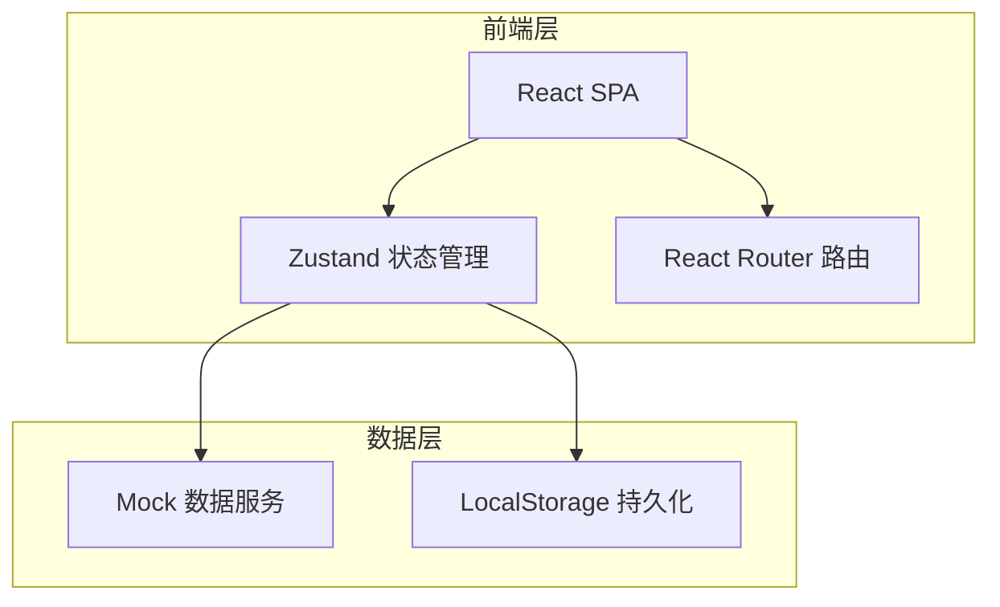
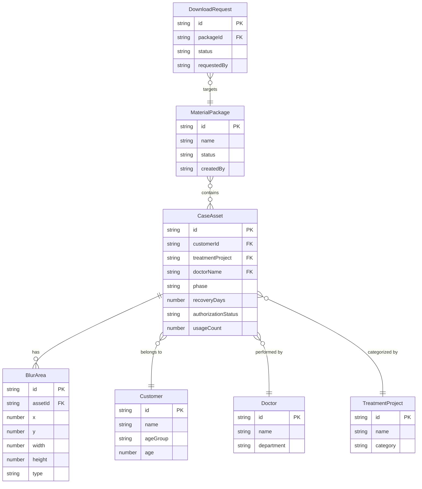

## 1. 架构设计



本项目为纯前端应用，使用 Mock 数据模拟后端接口，数据通过 LocalStorage 持久化。

## 2. 技术说明

- 前端：React@18 + TypeScript + TailwindCSS@3 + Vite
- 初始化工具：Vite
- 状态管理：Zustand（轻量级，适合中型应用）
- 图表库：Recharts（React 原生图表）
- 后端：无（纯前端 Mock）
- 数据库：无（LocalStorage + 内存 Mock）

## 3. 路由定义

| 路由 | 用途 |
|------|------|
| / | 重定向至 /ingestion |
| /ingestion | 素材入库页：批量上传、元数据录入、自动归档、打码工具 |
| /archive | 案例档案页：案例列表、前后对比、恢复时间轴、医生点评 |
| /review | 合规审核页：审核队列、授权标记、打码确认、过期提醒 |
| /deploy | 投放选用页：多维筛选、素材包生成、下载审批 |
| /dashboard | 数据看板页：KPI卡片、使用统计、项目分布、授权预警 |

## 4. API定义

无后端API，使用 Zustand Store + Mock 数据模拟以下数据服务：

```typescript
interface CaseAsset {
  id: string
  customerId: string
  customerName: string
  treatmentProject: string
  doctorName: string
  uploadDate: string
  mediaType: 'photo' | 'video'
  mediaUrl: string
  phase: 'pre-op' | 'post-op'
  recoveryDays: number
  shootAngle: string
  lightStandard: string
  canShowFace: boolean
  isBlurred: boolean
  blurAreas: BlurArea[]
  authorizationStatus: 'authorized' | 'pending' | 'rejected' | 'expired'
  authorizationExpiry: string
  tags: string[]
  applicableChannels: string[]
  doctorComment: string
  consultationSummary: string
  usageCount: number
  reviewStatus: 'pending' | 'approved' | 'rejected'
}

interface BlurArea {
  x: number
  y: number
  width: number
  height: number
  type: 'mosaic' | 'blur'
}

interface MaterialPackage {
  id: string
  name: string
  caseIds: string[]
  createdBy: string
  createdAt: string
  status: 'pending' | 'approved' | 'rejected'
  targetChannels: string[]
  downloadCount: number
}

interface DownloadRequest {
  id: string
  packageId: string
  requestedBy: string
  status: 'pending' | 'approved' | 'rejected'
  requestedAt: string
}
```

## 5. 服务器架构图

不适用（纯前端应用）

## 6. 数据模型

### 6.1 数据模型定义



### 6.2 数据定义语言

使用 TypeScript 接口定义数据结构，初始化时生成 Mock 数据存入 Zustand Store，变更同步至 LocalStorage。
